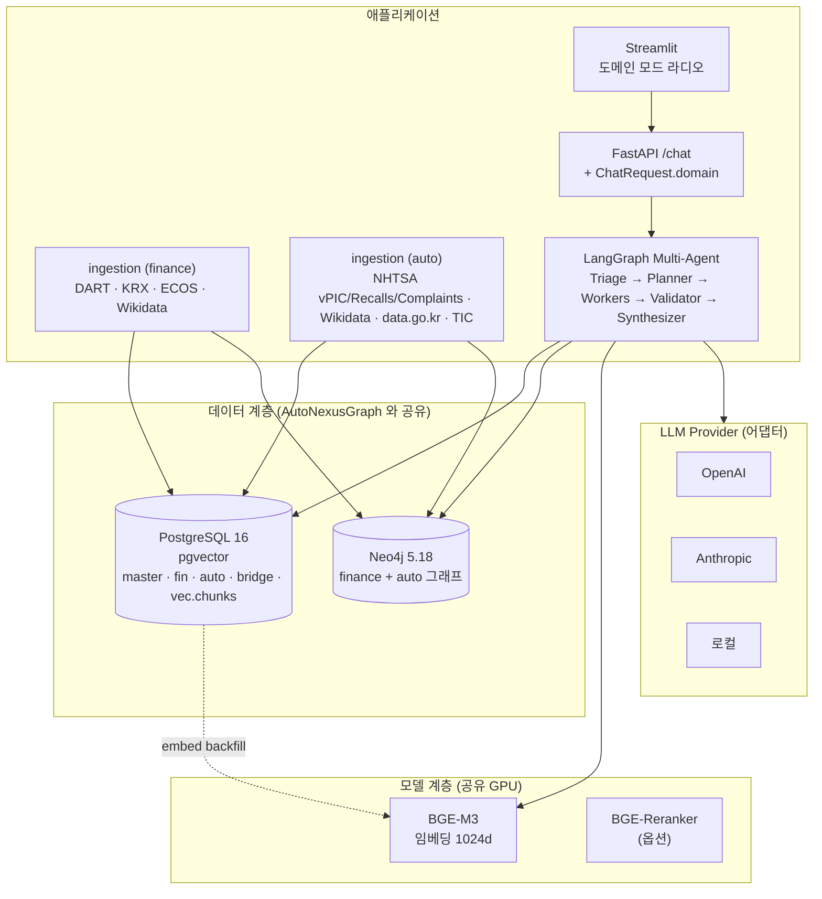
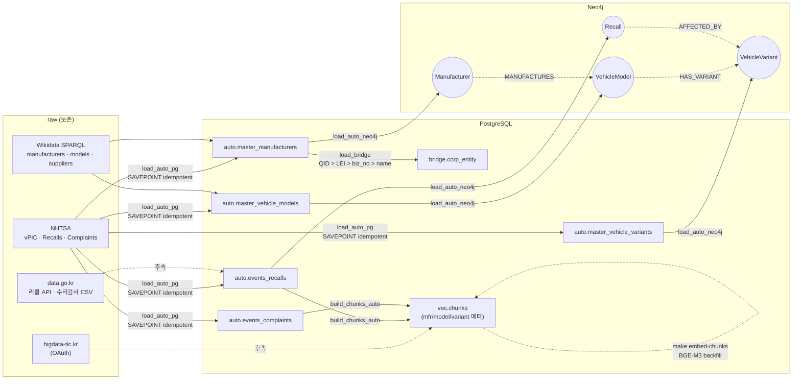
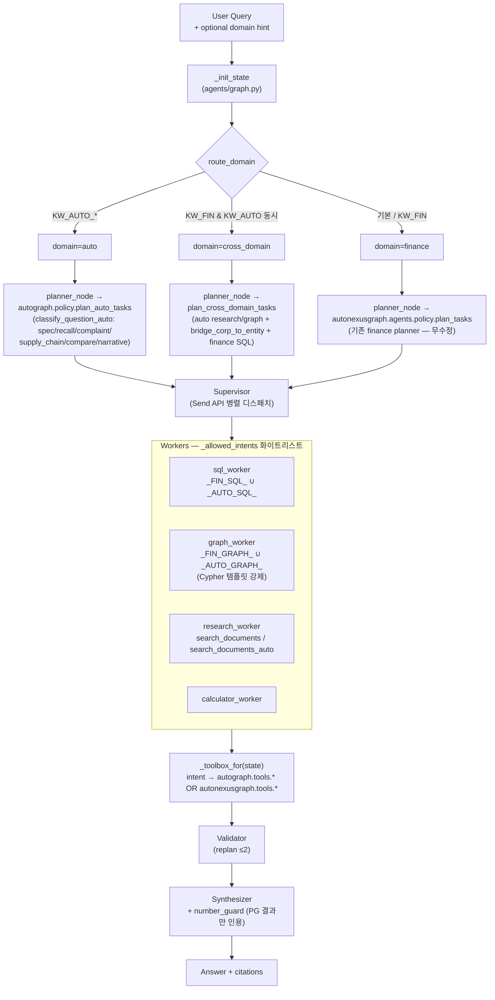
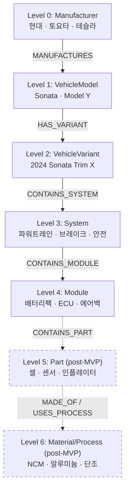

# AutoGraph — 자동차 도메인 GraphRAG (PRD v2.0)

AutoNexusGraph(금융) 코어 위에 **자동차 제품·부품·리콜·공급망 GraphRAG**를 얹은 추가 도메인.
LangGraph multi-agent, PG/Neo4j/pgvector, cost/number/cypher guard 등 핵심 인프라는 그대로
재사용한다. 새 코드는 `src/autograph/` 별도 패키지로 격리.

## 1. 구조

```
src/autograph/
  config.py                       # AutoGraph 전용 .env 키 (NHTSA·Wikidata·KATRI 등)
  policy.py                       # 도메인 라우터 + auto 분류/플래너
  cypher_templates_auto.py        # AUTO_TEMPLATES — finance TEMPLATES 에 자동 병합
  ingestion/
    nhtsa_vpic.py                 # 제조사·모델·연식·제원
    nhtsa_recalls.py              # 리콜 이벤트
    nhtsa_complaints.py           # 결함 신고/컴플레인
    wikidata_auto.py              # 제조사/모델/공급사 QID + LEI/사업자번호
    car_go_kr_recalls.py          # TODO — 한국 자동차리콜센터 (수동 CSV → normalize)
  loaders/
    neo4j_init.py                 # CONSTRAINT/INDEX 멱등 생성
    load_auto_pg.py               # raw → auto.* PG UPSERT
    load_auto_neo4j.py            # PG → Neo4j MERGE (SSOT=PG)
    load_bridge.py                # bridge.corp_entity 매칭 (QID > LEI > 사업자번호 > name)
    build_chunks_auto.py          # 리콜/컴플레인 텍스트 → vec.chunks
  tools/
    spec.py                       # PG SQL — lookup_vehicle / get_spec / compare_vehicles
    graph.py                      # Neo4j — list_recalls_affecting / list_components / ...
    retrieve.py                   # pgvector — search_documents_auto (manufacturer_id 필터)
    bridge.py                     # cross-domain — bridge_corp_to_entity / bridge_entity_to_corp

infra/postgres/init/
  07_autograph.sql                # auto.* 스키마
  08_bridge.sql                   # bridge.corp_entity
  09_vec_chunks_auto_meta.sql     # vec.chunks 에 manufacturer_id/model_id/variant_id 추가

eval/qa_gold/gold_qa_auto_v0.jsonl  # MVP QA seed (SQL/Vector/Graph/Cross-Domain 혼합)
```

## 2. 데이터 흐름 (한 줄 요약)

```
NHTSA / Wikidata raw
       │
       ▼  data/raw/auto/<source>/
  ingestion (멱등, RateLimiter + CheckpointStore)
       │
       ▼
  loader → auto.* (PG) ──→ load_auto_neo4j ──→ Neo4j 노드/관계
       │                                                 │
       ▼                                                 ▼
  bridge.corp_entity ←── load_bridge ←── master.entity_map (finance)
       │
       ▼
  자동차 청크 → vec.chunks (manufacturer_id/model_id/variant_id 메타)
       │
       ▼
  Agent (domain='auto' | 'cross_domain')
    ├ planner_node → autograph.policy.plan_auto_tasks / plan_cross_domain_tasks
    ├ workers      → autograph.tools.* (자유 SQL/Cypher 금지)
    └ synthesizer  → number_guard 통과 후 LLM 합성
```

## 2.5. 시스템 아키텍처 다이어그램

### 2.5.1 컨테이너 토폴로지 — AutoNexusGraph 인프라 공유



### 2.5.2 데이터 흐름 (멱등 파이프라인)



### 2.5.3 도메인 라우팅 (한 turn 의 흐름)



### 2.5.4 BOM 계층 (PRD §4.4)



## 3. PRD 핵심 원칙 적용

| 원칙 | 어디서 강제하는지 |
|---|---|
| 정량 수치는 PG 조회 결과만 | `autograph.tools.spec.get_spec` / `compare_vehicles` 결과 → `number_guard` 화이트리스트 |
| 자유 SQL/Cypher 금지 | 모든 Cypher 는 `cypher_templates_auto.AUTO_TEMPLATES` 레지스트리 경유. SQL 은 사전 정의 함수만 |
| 관계 source/confidence/validated_status/snapshot_year 필수 | `load_auto_neo4j` 의 MERGE 모두 동봉. candidate 는 0.5~0.8 confidence + `validated_status='candidate'` |
| LLM 이 부품/공급사 관계 생성 금지 | loader 는 PG SSOT 데이터만 사용. Wikidata 후보도 명시적으로 candidate. synthesizer 프롬프트에 강제 (PRD §7.5.x) |
| Cross-Domain bridge | `bridge.corp_entity` — Wikidata QID > LEI > 사업자번호 > name 매칭. 자동 매칭은 `candidate`, 검토 후 `reviewed` |

## 4. 실행 순서

### 4.1 사전 준비

```bash
# 1) 코어 인프라 가동 (Neo4j + PG + pgvector)
make up

# 2) 자동차 마이그레이션 적용 — docker compose 초기화 시 자동 실행되지만, 기존 DB 에는 수동 적용.
docker compose exec postgres psql -U autonexusgraph -d autonexusgraph \
    -f /docker-entrypoint-initdb.d/07_autograph.sql
docker compose exec postgres psql -U autonexusgraph -d autonexusgraph \
    -f /docker-entrypoint-initdb.d/08_bridge.sql
docker compose exec postgres psql -U autonexusgraph -d autonexusgraph \
    -f /docker-entrypoint-initdb.d/09_vec_chunks_auto_meta.sql

# 3) Neo4j 제약/인덱스
make neo4j-init-auto
```

### 4.2 Ingestion (raw 다운로드)

```bash
# 단발 — 현대 2024 한 차종/연식
make ingest-auto-vpic        MAKES=HYUNDAI YEARS=2024
make ingest-auto-recalls     MAKE=HYUNDAI  YEAR=2024
make ingest-auto-complaints  MAKE=HYUNDAI  YEAR=2024
make ingest-auto-wikidata

# 일괄 — .env 의 AUTO_INGEST_MAKES / AUTO_INGEST_YEAR_*
make ingest-auto-all
```

raw 경로: `data/raw/auto/{nhtsa_vpic,nhtsa_recalls,nhtsa_complaints,wikidata}/`

### 4.3 Loader (PG → Neo4j → bridge → 청크)

```bash
make load-auto-all
# = load-auto-pg → load-auto-neo4j → load-auto-bridge → build-chunks-auto
```

### 4.4 Tool 단위 확인

```bash
$(PYTHON) -c "from autograph.tools.spec import lookup_vehicle; \
              print(lookup_vehicle('Grandeur', year=2024))"
$(PYTHON) -c "from autograph.tools.graph import list_recalls_affecting; \
              print(list_recalls_affecting(model_id=1))"
$(PYTHON) -c "from autograph.tools.bridge import bridge_corp_to_entity; \
              print(bridge_corp_to_entity('00164742'))"
```

### 4.5 Agent end-to-end

```bash
# 자동차 도메인 (명시)
curl -X POST localhost:8000/chat -H 'content-type: application/json' \
  -d '{"message":"현대 그랜저 2024 변속기는?","domain":"auto"}'

# auto-detect (router 가 키워드로 판정)
curl -X POST localhost:8000/chat -H 'content-type: application/json' \
  -d '{"message":"Tesla Model Y 2023 리콜 사례 알려줘"}'

# cross-domain
curl -X POST localhost:8000/chat -H 'content-type: application/json' \
  -d '{"message":"현대자동차의 2024년 매출과 그랜저 리콜 건수 관계는?",
       "domain":"cross_domain"}'
```

UI 사이드바에 도메인 라디오(`auto-detect | finance | auto | cross_domain`) 추가됨.

### 4.6 평가

```bash
make eval-auto
# eval/reports/auto_<timestamp>/summary.md 확인
```

## 5. 알려진 제약 / TODO

스키마는 정의돼 있지만 **MVP 적재 경로가 없는 테이블** (PRD post-MVP 항목):

- `auto.spec_measurements` — `load_auto_pg.py` 가 의도적으로 비어 있음 (vPIC variants 의 unit·key 매핑 후속). 결과적으로 `get_spec / compare_vehicles / get_safety_rating` 은 현재 모두 빈 결과 반환. 에이전트가 spec 질문을 plan 해도 비어있는 응답.
- `auto.components` — schema (`07_autograph.sql:124`) 정의는 있되 loader 없음. `list_components`, `get_suppliers_of_component`, `get_vehicles_using_component` 등 그래프 쿼리도 자연히 빈 결과. 공개 BOM 데이터 부재로 post-MVP.
- supplier 관계 — `wikidata_auto.py --kind suppliers` 를 명시적으로 호출해야 `data/raw/auto/wikidata/suppliers.jsonl` 가 생기고 `load_bridge` 가 후보 적재. 기본 `make ingest-auto-all` 은 manufacturers 만 받음.

데이터 소스 외부 의존 (코드는 있되 키/수동 단계 필요):

- **NCAP / IIHS 안전 등급** — 별도 수집 미구현. `spec_measurements` 에 `safety.*` 키로 들어
  오면 `get_safety_rating()` 이 반환. (MVP 에선 비어 있을 수 있음)
- **한국 자동차리콜센터 (car.go.kr)** — 공식 OpenAPI 미정. `data/raw/auto/car_go_kr/*.csv`
  수동 다운로드 시 `python -m autograph.ingestion.car_go_kr_recalls` 가 normalize.
- **KATRI / KNCAP** — 인증키 미발급. 키 없을 시 graceful skip.
- **Level 5~6 BOM (소재·공법)** — 공개 데이터 거의 없음. 본 MVP 는 System → Component 까지.
- **Wikidata supplier 후보** — `bridge.corp_entity` 에 `confidence < 1.0` candidate 만 적재.
  사람 검토 후 `reviewed_status='reviewed'` 로 승급해야 운영용 그래프에 사용.
- **임베딩** — 자동차 청크의 embedding 채우기는 finance 와 동일하게 별도 `embed-chunks`
  과정 필요 (BGE-M3 서버).

향후 개선 (성능):

- `load_recalls / load_complaints` 가 row 마다 manufacturer/model/variant 3 단 SELECT 를 수행 (N+1). 대량 적재 시 single LEFT JOIN 로 통합 권장.
- `nhtsa_vpic/recalls/complaints` 의 `_http_get` 이 3회 거의 동일 — `_common_nhtsa.py` 로 합칠 만함.

## 6. 회귀 안전

- finance 도메인 tool / 라우팅 / SQL 은 무수정. `state['domain']` 미지정 시 router 가
  키워드로 자동 판정 (자동차 키워드 없으면 `finance` 기본).
- `vec.chunks` 의 `corp_code` NOT NULL 제약은 nullable 로 완화됨 — 기존 finance 청크는
  영향 없음 (이미 NOT NULL 로 채워져 있음).
- `cypher_templates_auto.AUTO_TEMPLATES` 키는 `auto_` 접두사로 finance 키와 충돌 안 함.
  병합은 `src/autograph/tools/__init__.py` import 시 1회 실행.
